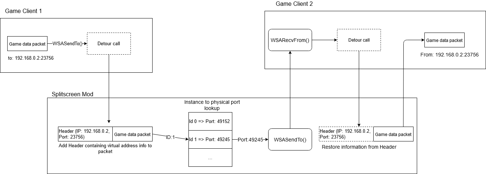

# Local virtual component

This chapters requires some familiarity with the [Winsock API](https://docs.microsoft.com/en-us/windows/win32/winsock/getting-started-with-winsock) and its asynchronous variant using [Overlapped IO](https://docs.microsoft.com/en-us/windows/win32/winsock/overlapped-i-o-and-event-objects-2), as well as API hooking/detouring in general. Additionally understanding of general networking (IP-addresses, ports, UDP) is needed.  

## Overview

Allowing players to run multiple instances of the game on one machine requires resolving network port conflicts. These conflicts are caused by the two hard coded ports used by FlatOut2. One Port is used to discovery open lobbies in the network using broadcasts. The other port is then used for the actual game messages.

While these ports can be changed in the game's `options.cfg` file, lobby discovery is only possible if the ports are identical and therefore conflicting. To resolve this port conflict, the mod includes a virtual network component. This component allows each instance of the game to receive its own unique IP address and transparently manages network traffic between the instances. The functionality is somewhat similar to a VPN, but is handled entirely in software and requires no true virtual network devices.  

While the mod was built for FlatOut 2, the networking component doesn't rely on any game specific implementation details and could therefore be used in other games that use UDP networking through the Winsock API.

## Implementation

### Source files

Code for the virtual network component can be found in the base class `VirtualIP`, the specialized classes `VirtualHost` and `VirtualClient` for the host instance and other clients respectively. Hooks for the Winsock API are found in `WinSockDetours.cpp`.

### Explanation

The virtual network component is initialized by requesting a UDP socket from the OS with automatic port assignment enabled. The randomly assigned port number is stored in the shared memory accessible by all game instances. Now when the player enters the LAN menu the game requests its regular UDP sockets from the OS using the "hard coded" port numbers. These calls are intercepted by the mod and instead register a virtual socket. To register the socket, the mod creates a struct with all the information required to service the virtual socket such as buffers, IO events and internal state. This struct is stored in a dictionary using the socket descriptor as an index. This allows retrieval of the internal socket struct since all future network IO calls will use this to socket descriptor as a reference.  

When the game sends a UDP packet a header is added to the beginning which contains the virtual address and port of the target instance. This modified packet is the sent to the target on the physical port created by the mod. On the receiving side the virtual information is then restored from the header and by looking up the source client id through the sender's port number. The game's regular network handlers are then signaled and receive the packet like if it was sent from a real host.

When accessing the game's LAN mode, chronologically the game will search for available LAN games by sending a discovery request on the broadcast address (255.255.255.255). Currently, to simplify the implementation, client's broadcast messages are only sent to the instance with the ID of zero which will be referred to as the host instance. If a game is available on the host instance, it will answer the discovery request with information about the available session. This information is sent to the broadcast address as well and in contrast to the clients implementation, the message are distributed to all clients like a physical broadcast. Due to this limitation only the host instance is able to host LAN games.

## Limitations and potential improvements  

### Reliance on host instance

Only the instance with ID 0 can publish broadcast messages to all other instances. While broadcasts requires individually sending separate packets to each clients port, the overhead caused by this should be negligible. This would allow any instance to host LAN games.  

### Virtual headers reduce the max packet size

Since a header is appended to each packet, the maximum packet size usable by the game is limited. Sending such a packet is currently undefined behavior that might crash the mod. During testing with 8 game instances no packet was sent that was large enough to be affected by this limitation.

### Allow communications between multiple physical hosts

Currently the virtual network is restricted to one physical computer. However since regular networking operations are used to achieve the virtualization, it would be possible to route packet between physical hosts as well. These hosts could be in the same LAN or even only via regular internet. However the routing would require distribution of the virtual network configuration through the network instead of relying on shared memory.
